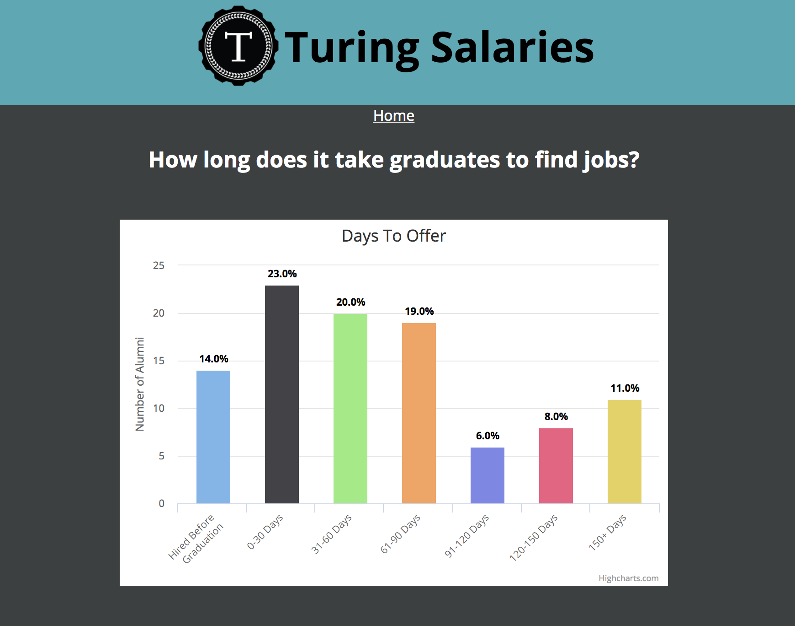

[Heroku Link To Project](https://turingsalaries.herokuapp.com/)

### Turing-Salaries was a two week project partnered capstone project. We took data from people who submitted information about their first job out of the Turing School Software and Design, and did data visualizations on the aggregrated data. We used HighCharts library for the first time, which was great library for interactive data visualizations.

* Tech Stack: React, Redux, Node.js, Express, HighCharts 
# Academy
